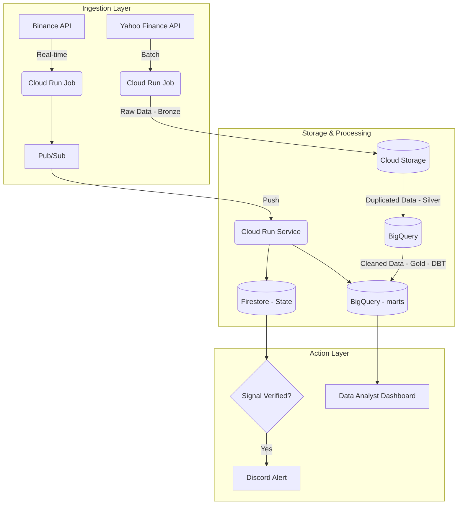

# 🚀 Global Financial Data Platform (GCP)

### From Data Analyst to Data Engineer: A Complete End-to-End Data Ecosystem

This repository serves as the central hub for a financial data platform designed to demonstrate the convergence of **Batch Processing**, **Real-time Streaming**, and **Infrastructure as Code (IaC)** within the Google Cloud Platform (GCP) ecosystem.

---
## 🏗️ System Architecture

The platform is architected into two distinct operational layers that provide a 360° view of market dynamics:

### 1. Historical Analytical Layer (Batch)
**Repository:** https://github.com/AFGU94/finance-lakehouse-batching

**Objective:** Massive ingestion of historical market data for trend analysis and model training.

**Stack:** Python (Yahoo Finance API), GCS (Bronze), BigQuery (Silver/Gold).

**Key Engineering Features:** Implementation of Partitioning and Clustering in BigQuery to optimize query performance and minimize processing costs.

### 2. Proactive Monitoring Layer (Real-time)
**Repository:** https://github.com/AFGU94/real_time_monitor_streaming

**Objective:** High-frequency technical signal detection (RSI, EMA) in 15-minute intervals for immediate decision-making.

**Stack:** Docker, Cloud Run Jobs, Firestore (State Management), Discord Webhooks.

**Key Engineering Features:** Leveraged Firestore to maintain idempotency (preventing redundant alerts) and implemented "Price Averaging" logic to detect dip-buying opportunities.

---
## 🛠️ Tech Stack & Cloud-Native Integration
**Infrastructure:** Terraform (IaC) for reproducible, secure, and version-controlled deployments.

**Compute:** Cloud Run Jobs (Serverless) for high-efficiency, event-driven execution.

**Database:** BigQuery (Analytical Warehouse) & Firestore (NoSQL / Operational State).

**Security:** Google Secret Manager for robust API Key and credential management.

**DevOps:** Artifact Registry Cleanup Policies for automated image lifecycle management.

---
## 💰 FinOps: Cost Optimization by Design

A core pillar of this project was engineering within the GCP Always Free Tier constraints without sacrificing professional standards:

**BigQuery:** Strategic use of TTL (Time To Live) and Partitioning to remain under the 10GB free storage limit.

**Artifact Registry:** Automated cleanup policies to retain only the latest active container image, minimizing storage costs.

**Firestore:** 30-day TTL on alert documents to maintain a lean NoSQL footprint.

---
## 📈 Project Evolution & Professional Roadmap
This ecosystem represents my strategic transition from data storytelling to cloud infrastructure architecture. My journey has evolved through three pivotal stages:

1. **Data Analyst Phase (The "What"):** I began by extracting value through Exploratory Data Analysis (EDA) and visualization. I quickly realized that high-quality insights are only as good as the reliability of the underlying data pipeline.

2. **Associate Cloud Engineer Phase (The "Where"):** To build production-grade solutions, I earned the Google Cloud Associate Cloud Engineer (ACE) certification. This enabled me to architect this ecosystem using industry best practices for Identity and Access Management (IAM), Resource Hierarchy, and Global Networking.

3. **Data Engineer Phase (The "How"):** I now scale data solutions using Terraform, serverless orchestration, and modern data modeling (Star Schema/Lakehouse). This project proves my ability to manage the entire data lifecycle—from raw API ingestion to actionable insights—while prioritizing FinOps and system reliability.

**Connect with me:** https://www.linkedin.com/in/andresfelipegutierrezu/| pipegutierrez.u@gmail.com
